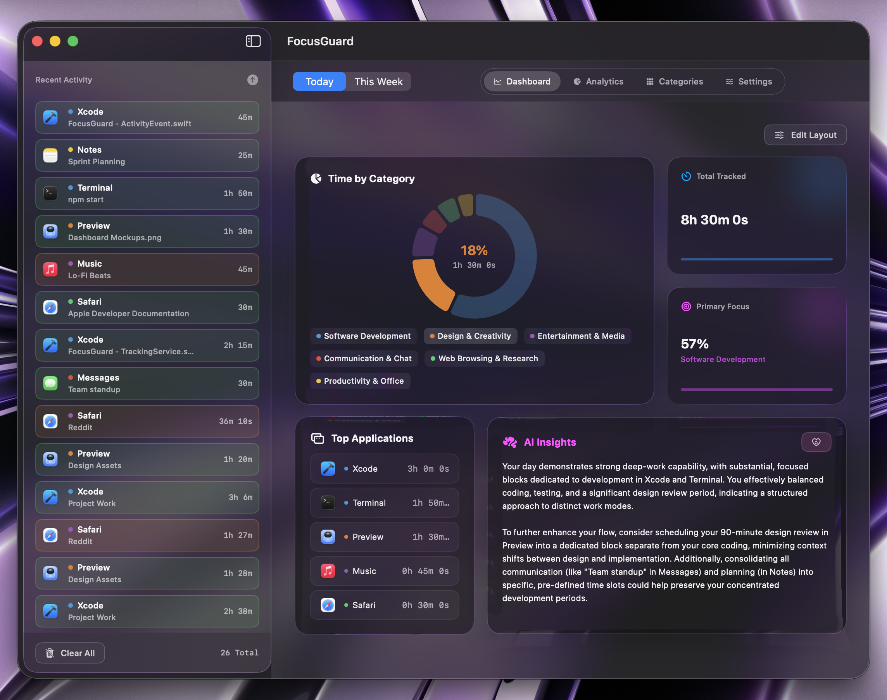
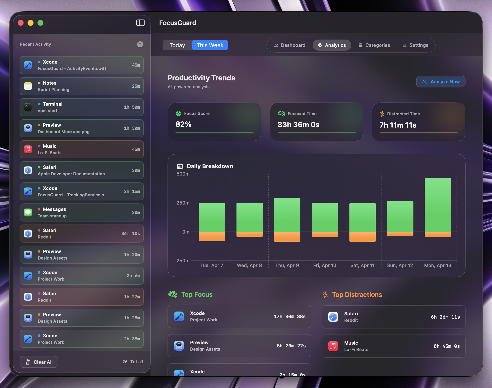

<p align="center">
  
</p>

<p align="center">
  
  
  
  
  
  
</p>

<h2 align="center">FocusGuard — macOS Productivity Tracker</h2>
<p align="center">A menu bar app that monitors your active apps in real time and uses AI to categorize your focus sessions.</p>

---

## Screenshots

<p align="center">
  
  
</p>

---

## How It Works

```
NSWorkspace                Accessibility API
     │                           │
     ▼                           ▼
 Active App Name  +  Window Title
           │
           ▼
     TrackingService
     (polls every N sec)
           │
           ▼
      Claude API  ──▶  Category (Deep Work / Social / etc.)
           │
           ▼
       SwiftData  ──▶  Session History
```

## Features

- **Automatic tracking** — monitors active app and window title every few seconds
- **AI categorization** — Claude API classifies activity in real time
- **Minimal footprint** — lives in the menu bar, stays out of your way
- **Custom rules** — define categories and keyword-based matching rules
- **Session history** — all events stored locally via SwiftData
- **Secure key storage** — API key stored in Keychain, not in files

## Tech Stack

| Layer | Technology |
|-------|-----------|
| UI | SwiftUI + MenuBarExtra |
| Reactivity | `@Observable` (Observation framework) |
| Storage | SwiftData |
| Tracking | NSWorkspace + Accessibility API |
| AI | Claude API (Anthropic) |
| Security | Keychain Services |

## Requirements

- macOS 14 Sonoma or later
- Xcode 15+
- Anthropic API key

## Getting Started

```bash
git clone https://github.com/ayeresell/FocusGuard.git
open FocusGuard.xcodeproj
```

1. Build & run in Xcode
2. Grant **Accessibility** permission (`System Settings → Privacy & Security → Accessibility`)
3. Add your Anthropic API key in the app settings
